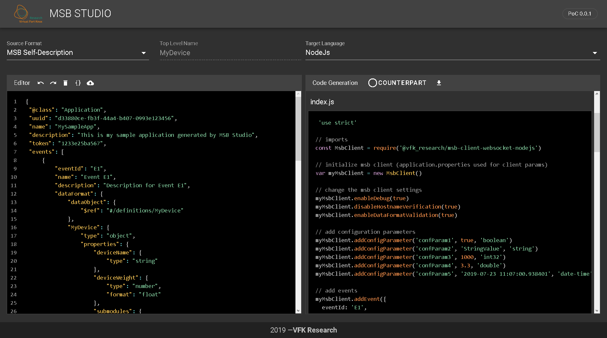

# MSB Studio

MSB Studio is a simple WebIDE to facilitate the integration of your services by providing auto-generated client code for a quick-start.

It is currenlty in the state of a proof-of-concept. Feel free to test it and send us your feedback by adding an issue.



If you want to contribute, please read the [Contribution Guidelines](.github/CONTRIBUTING.md).

If you want to know how to run MSB Studio locally, read below.

## Features

Features:
- Client-generation: Converts a self-description (json format) into an msb client implementation
- Counterpart-generation: Generates a counterpart service based on a self-description
- MSB-Instance Integration: Connect to a running MSB instance and load a self-description of a service to generate a counterpart service.
- Experimental: Generates data model and dedicated converters based on json and json schema input

Supported client languages:
- NodeJs
- Python
- Node-RED Flow

Languages supported in a future release:
- Java
- C/C++
- CSharp

## Public instance (Test)

You can access a public instance here:
https://msbstudio.oss.cell.vfk.fraunhofer.de/

## Run self-hosted MSB Studio using docker

We work on providing a public docker image.

Currently, you have to Build the docker image locally:

```sh
$ docker build -t vfk.msb.studio:latest .
```

Run docker container for your new image:

```sh
$ docker run -d --restart always --name vfk.msb.studio -p 8080:80 vfk.msb.studio:latest
```

## Run MSB Studio for development, testing or development locally

To run the MSB Studio using NodeJs, first checkout this repository.

Make sure NodeJs and NPM ist set up on your machine.

Setup the project:
```
npm install
```

Compile and start a dev server:
```
npm run serve
```

Open MSB Studio: http://localhost:8080
